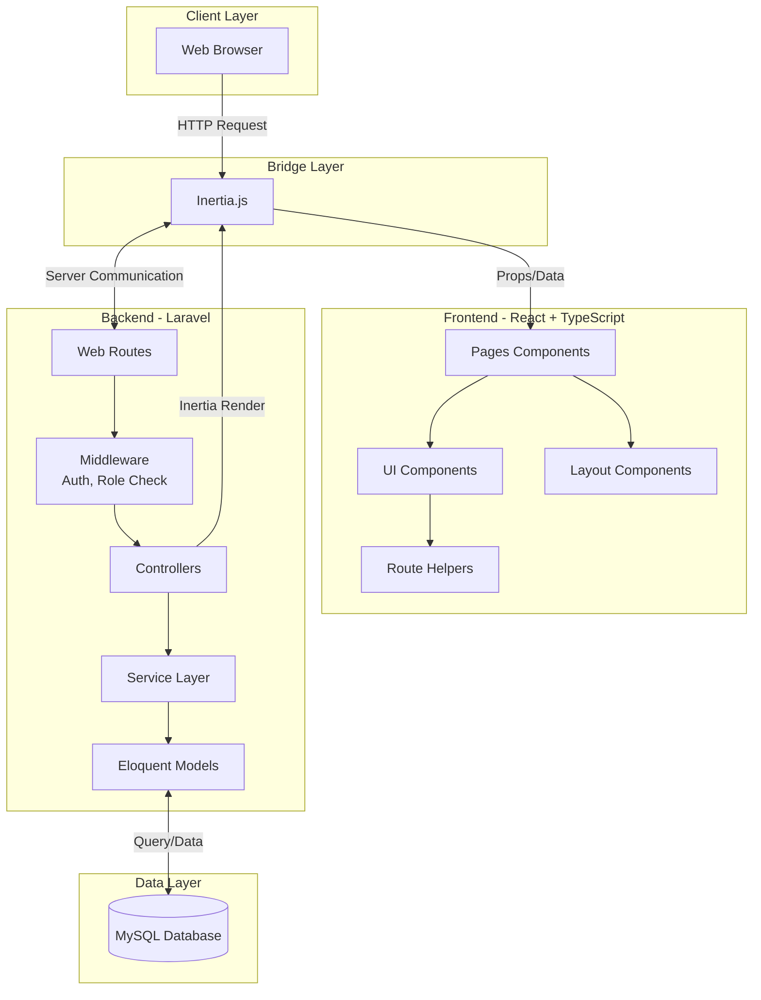
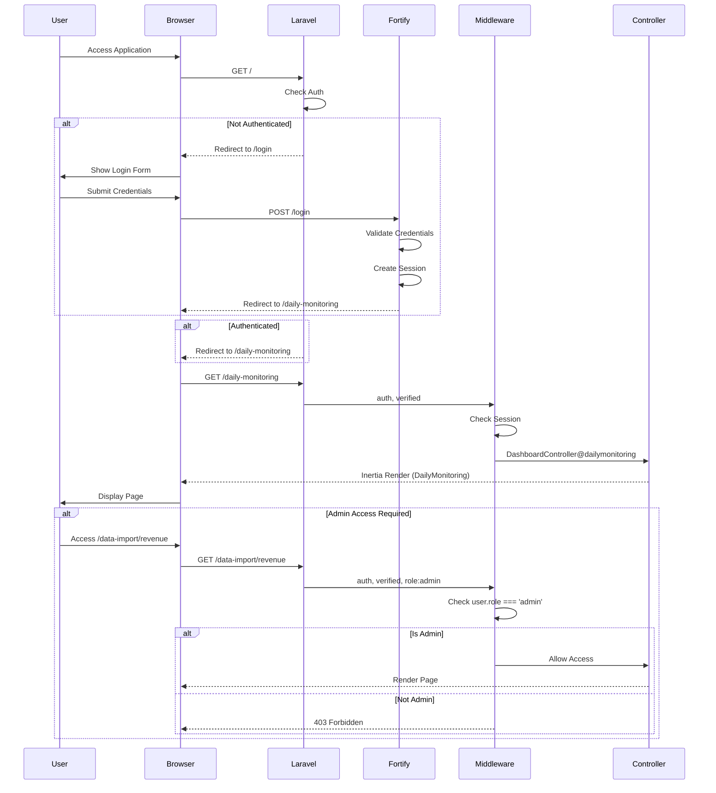
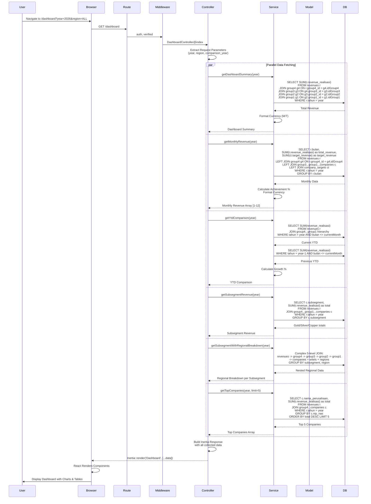
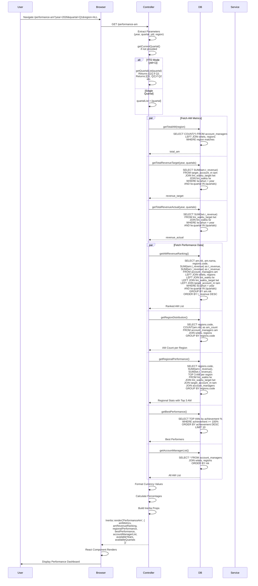
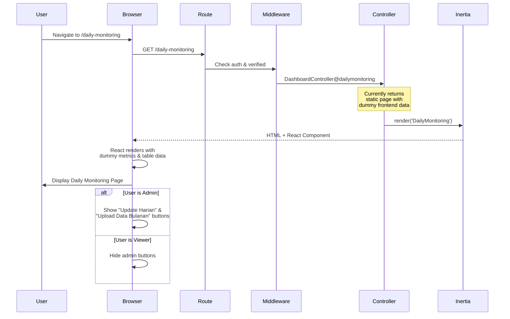
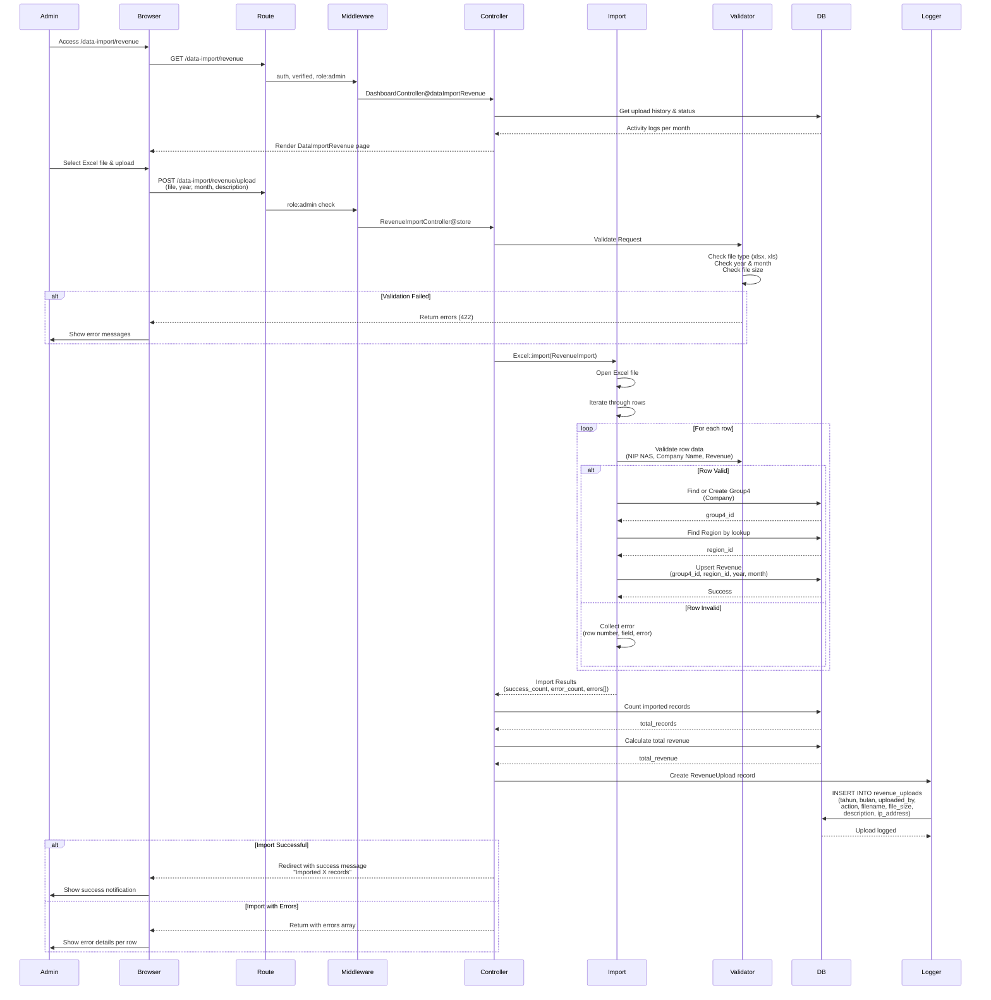
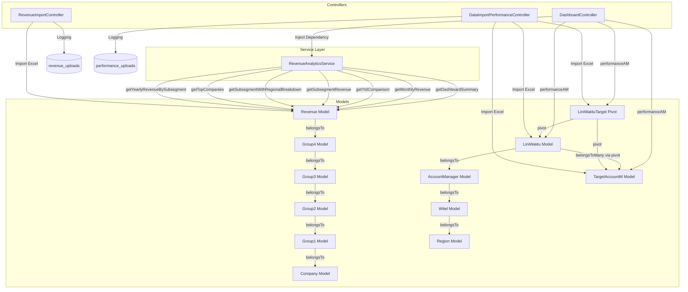
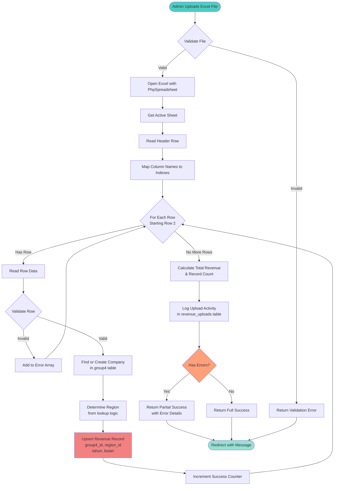
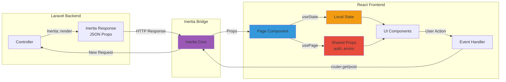

# TWS Dashboard - Revenue & Performance Analytics System

Sistem dashboard analytics untuk monitoring revenue dan performance Account Manager di Telkom Wholesale Service.

## Tech Stack

- **Backend:** Laravel 11 (PHP 8.2+)
- **Frontend:** React 19 + TypeScript
- **Bridge:** Inertia.js v2
- **UI Framework:** Tailwind CSS v4 + shadcn/ui
- **Database:** MySQL
- **Authentication:** Laravel Fortify
- **Authorization:** Role-based (Admin/Viewer)

---

## System Architecture



---

## Database Architecture (ERD)

```mermaid
erDiagram
    USERS {
        bigint id PK
        string name
        string email UK
        string username UK
        string password
        string role "admin, viewer"
        timestamp email_verified_at
        timestamps created_at_updated_at
    }
    
    REGIONS {
        bigint id PK
        string code UK "HQ, TREG1-5"
        string name
        timestamps created_at_updated_at
    }
    
    WITELS {
        bigint idwitels PK
        bigint region_id FK
        string witel
        string lokasi_witel
        timestamps created_at_updated_at
    }
    
    ACCOUNT_MANAGERS {
        string nik PK
        string nama
        string posisi "AM, AM1, AM2, EAM, SAM"
        string no_gsm
        bigint idwitels FK
        timestamps created_at_updated_at
    }
    
    COMPANIES {
        string nip_nas PK
        string nama_perusahaan
        string subsegment "Gold, Silver, Copper"
        string source_data
        timestamps created_at_updated_at
    }
    
    GROUP1 {
        bigint idGroup1 PK
        string nip_nas FK
        string lob_name
        string segment
        timestamps created_at_updated_at
    }
    
    GROUP2 {
        bigint idGroup2 PK
        bigint group1_id FK
        string layanan
        timestamps created_at_updated_at
    }
    
    GROUP3 {
        bigint idGroup3 PK
        bigint group2_id FK
        string produk
        timestamps created_at_updated_at
    }
    
    GROUP4 {
        bigint idGroup4 PK
        bigint group3_id FK
        string sid
        string unit
        timestamps created_at_updated_at
    }
    
    REVENUES {
        bigint id PK
        bigint group4_id FK
        year tahun
        tinyint bulan "1-12"
        decimal revenue_realisasi
        decimal revenue_target
        timestamps created_at_updated_at
        unique group4_id_tahun_bulan
    }
    
    REVENUE_UPLOADS {
        bigint id PK
        int tahun
        int bulan
        bigint uploaded_by FK
        string original_filename
        int row_count
        decimal file_size_kb
        timestamps created_at_updated_at
        index tahun_bulan
    }
    
    LINI_WAKTU {
        bigint id PK
        string nik_am FK
        string quartal "Q1-Q4"
        date bulan_awal
        date bulan_akhir
        int tahun
        decimal percentage_result
        decimal percentage_revenue
        decimal percentage_scaling
        decimal percentage_datin
        decimal percentage_hsi
        decimal percentage_wireline
        decimal percentage_wifi
        decimal percentage_cyc
        decimal percentage_cr
        decimal percentage_profit
        decimal percentage_customer
        decimal percentage_proses
        decimal percentage_maps
        decimal percentage_lop
        decimal percentage_capability
        decimal percentage_cc
        timestamps created_at_updated_at
    }
    
    PERFORMANCE_UPLOADS {
        bigint id PK
        int tahun
        string quartal
        bigint uploaded_by FK
        string original_filename
        int row_count
        decimal file_size_kb
        timestamps created_at_updated_at
    }
    
    TARGET_ACCOUNT_M {
        bigint id PK
        decimal t_revenue "Target Revenue"
        decimal t_scalling
        decimal t_datin
        decimal t_hsi
        decimal t_wireline
        decimal t_wifi
        decimal t_cyc
        decimal t_cr
        decimal t_profit
        decimal t_nps
        decimal t_maps
        decimal t_lop
        decimal t_capability
        decimal t_cc
        timestamps created_at_updated_at
    }
    
    LINI_WAKTU_TARGET {
        bigint id PK
        bigint lini_waktu_id FK
        bigint target_id FK
        decimal r_revenue "Realisasi Revenue"
        decimal r_scalling
        decimal r_datin
        decimal r_hsi
        decimal r_wireline
        decimal r_wifi
        decimal r_cyc
        decimal r_cr
        decimal r_profit
        decimal r_nps
        decimal r_maps
        decimal r_lop
        decimal r_capability
        decimal r_cc
        timestamps created_at_updated_at
    }
    
    ACCOUNT_MANAGER_COMPANY {
        bigint id PK
        string nik_am FK
        string nip_nas FK
        date tanggal_mulai
        date tanggal_selesai
        timestamps created_at_updated_at
    }
    
    USERS ||--o{ REVENUE_UPLOADS : uploads
    USERS ||--o{ PERFORMANCE_UPLOADS : uploads
    
    REGIONS ||--o{ WITELS : contains
    WITELS ||--o{ ACCOUNT_MANAGERS : manages
    
    ACCOUNT_MANAGERS ||--o{ LINI_WAKTU : has_kpi
    ACCOUNT_MANAGERS ||--o{ ACCOUNT_MANAGER_COMPANY : manages
    
    LINI_WAKTU ||--o{ LINI_WAKTU_TARGET : has_targets
    TARGET_ACCOUNT_M ||--o{ LINI_WAKTU_TARGET : tracked_in
    
    LINI_WAKTU_TARGET }o--|| LINI_WAKTU : belongs_to
    LINI_WAKTU_TARGET }o--|| TARGET_ACCOUNT_M : achieves
    
    COMPANIES ||--o{ GROUP1 : has_lob
    COMPANIES ||--o{ ACCOUNT_MANAGER_COMPANY : managed_by
    
    GROUP1 ||--o{ GROUP2 : has_layanan
    GROUP2 ||--o{ GROUP3 : has_produk
    GROUP3 ||--o{ GROUP4 : has_unit
    
    GROUP4 ||--o{ REVENUES : generates
    
    REVENUES }o--|| GROUP4 : belongs_to
    LINI_WAKTU }o--|| ACCOUNT_MANAGERS : belongs_to
    REVENUE_UPLOADS }o--|| USERS : uploaded_by
    PERFORMANCE_UPLOADS }o--|| USERS : uploaded_by
```



---

## Authentication & Authorization Flow



---

## Revenue Dashboard - Complete Backend Flow



---

## Performance AM - Backend Processing Flow



---

## Daily Monitoring - Simple Flow



---

## Data Upload Flow - Revenue Import (Admin Only)



---

## Service Layer Architecture



---

## Route Structure & Middleware Flow

```mermaid
graph LR
    subgraph "Public Routes"
        Root[/ - home] -->|redirect| Login[/login]
    end
    
    subgraph "Authenticated Routes"
        Dashboard[/dashboard<br/>DashboardController@index]
        PerformanceAM[/performance-am<br/>DashboardController@performanceAM]
        DailyMonitoring[/daily-monitoring<br/>DashboardController@dailymonitoring]
    end
    
    subgraph "Admin Only Routes"
        DataImportRev[/data-import/revenue<br/>DashboardController@dataImportRevenue]
        DataImportPerf[/data-import/performance<br/>DataImportPerformanceController@index]
        UploadRev[POST /data-import/revenue/upload]
        UploadPerf[POST /data-import/performance/upload]
        DeleteData[DELETE /data-import/revenue/delete]
    end
    
    subgraph "API Routes"
        MonthlyData[/api/dashboard/monthly-data]
        CompanyDetails[/api/dashboard/company-details]
        SubsegmentDetails[/api/dashboard/subsegment-details]
        YtdComparison[/api/dashboard/ytd-comparison-custom]
    end
    
    subgraph "Middleware Chain"
        AuthMW{auth}
        VerifiedMW{verified}
        RoleMW{role:admin}
    end
    
    Login -->|Fortify Auth| AuthMW
    AuthMW -->|Pass| VerifiedMW
    VerifiedMW -->|Pass| Dashboard
    VerifiedMW -->|Pass| PerformanceAM
    VerifiedMW -->|Pass| DailyMonitoring
    VerifiedMW -->|Pass| MonthlyData
    
    VerifiedMW -->|Pass| RoleMW
    RoleMW -->|Admin| DataImportRev
    RoleMW -->|Admin| DataImportPerf
    RoleMW -->|Admin| UploadRev
    RoleMW -->|Admin| UploadPerf
    
    style RoleMW fill:#ff6b6b
    style AuthMW fill:#4ecdc4
    style VerifiedMW fill:#45b7d1
```

---

## Excel Import Processing Pipeline



---

## State Management & Data Flow (Frontend)



---

## Installation & Setup

### Prerequisites
- PHP 8.2+
- Composer
- Node.js 18+ & npm
- MySQL 8.0+

### Installation Steps

```bash
# Clone repository
git clone <repository-url>
cd dashboard-TWS

# Install PHP dependencies
composer install

# Install Node dependencies
npm install

# Copy environment file
cp .env.example .env

# Generate application key
php artisan key:generate

# Configure database in .env
DB_CONNECTION=mysql
DB_HOST=127.0.0.1
DB_PORT=3306
DB_DATABASE=tws_dashboard
DB_USERNAME=root
DB_PASSWORD=

# Run migrations
php artisan migrate

# Seed database (optional)
php artisan db:seed

# Build frontend assets
npm run build

# For development
npm run dev

# Start server
php artisan serve
```

### Default Credentials
After seeding:
- **Admin:** admin@tws.com / password
- **Viewer:** viewer@tws.com / password

---

## Project Structure

```
dashboard-TWS/
├── app/
│   ├── Http/
│   │   ├── Controllers/
│   │   │   ├── DashboardController.php
│   │   │   ├── RevenueImportController.php
│   │   │   └── DataImportPerformanceController.php
│   │   ├── Middleware/
│   │   │   └── CheckRole.php
│   │   └── Requests/
│   ├── Models/
│   │   ├── User.php
│   │   ├── Revenue.php
│   │   ├── Group4.php
│   │   ├── Region.php
│   │   ├── AccountManager.php
│   │   └── LiniWaktu.php
│   ├── Services/
│   │   └── RevenueAnalyticsService.php
│   └── Imports/
│       ├── RevenueImport.php
│       └── PerformanceImport.php
├── database/
│   ├── migrations/
│   └── seeders/
├── resources/
│   ├── js/
│   │   ├── pages/
│   │   │   ├── Dashboard.tsx
│   │   │   ├── PerformanceAm.tsx
│   │   │   ├── DailyMonitoring.tsx
│   │   │   ├── DataImportRevenue.tsx
│   │   │   └── DataImportPerformance.tsx
│   │   ├── components/
│   │   │   ├── ui/ (shadcn components)
│   │   │   ├── charts/
│   │   │   ├── modals/
│   │   │   └── sections/
│   │   ├── layouts/
│   │   ├── routes/
│   │   └── types/
│   └── views/
│       └── app.blade.php
├── routes/
│   ├── web.php
│   └── api.php
└── config/
    ├── fortify.php
    └── inertia.php
```

---

## Key Features

### 1. Revenue Dashboard
- YTD revenue tracking with year-over-year comparison
- Monthly revenue breakdown with target vs actual
- Subsegment analysis (Gold, Silver, Copper)
- Regional performance breakdown
- Top companies ranking
- Interactive charts (Bar, Line, Pie)
- Custom date range comparison

### 2. Performance AM
- Account Manager performance metrics
- Revenue target vs achievement per AM
- Regional distribution analysis
- Best performers ranking
- Quarter-by-quarter tracking
- Year-to-Date (YTD) analysis mode
- Detailed AM information table

### 3. Daily Monitoring
- Daily metrics overview
- Project progress tracking
- SCALING monitoring
- Progress status per project
- Real-time updates (admin only)

### 4. Data Upload (Admin Only)
- Excel import for revenue data
- Excel import for performance data
- Validation & error reporting
- Activity logging
- Download templates
- Data versioning per month/quarter
- Delete & re-upload capability

### 5. Role-Based Access Control
- **Admin:** Full access including data upload
- **Viewer:** Read-only access to dashboards

---

## API Endpoints

### Dashboard Analytics
- `GET /api/dashboard/monthly-data` - Get monthly revenue data
- `GET /api/dashboard/month-details` - Detailed month breakdown
- `GET /api/dashboard/company-details` - Company-level details
- `GET /api/dashboard/subsegment-details` - Subsegment analysis
- `GET /api/dashboard/subsegment-trend` - Trend analysis
- `GET /api/dashboard/ytd-comparison-custom` - Custom YTD comparison
- `GET /api/dashboard/available-periods` - Get available data periods

### Data Management (Admin)
- `POST /data-import/revenue/upload` - Upload revenue Excel
- `POST /api/data-import/performance/upload` - Upload performance Excel
- `GET /data-import/revenue/download-template/{year}` - Download template
- `DELETE /data-import/revenue/delete/{year}/{month}` - Delete month data
- `DELETE /api/data-import/performance/delete/{year}/{quarter}` - Delete quarter data

---

## Development Notes

### Adding New Routes
1. Define route in `routes/web.php`
2. Create/update controller method
3. Route helper will be auto-generated in `resources/js/routes/index.ts`

### Adding New Page
1. Create React component in `resources/js/pages/`
2. Use `AppLayout` or `AppSidebarLayout`
3. Controller renders with `Inertia::render('ComponentName', $data)`
4. TypeScript types in `resources/js/types/`

### Adding New Chart
1. Use Recharts library
2. Create component in `resources/js/components/charts/`
3. Follow existing patterns (Bar, Line, Pie charts)

### Database Changes
1. Create migration: `php artisan make:migration`
2. Run migration: `php artisan migrate`
3. Update seeders if needed

---

## Performance Considerations

- **Database Indexing:** Indexed on frequently queried columns (tahun, bulan, quartal, region_id)
- **Eager Loading:** Used throughout with `::with()` to prevent N+1 queries
- **Query Optimization:** Service layer implements optimized aggregations
- **Caching:** Consider implementing cache for dashboard summary data
- **Pagination:** Implemented for large data tables

---

## Security Features

- **CSRF Protection:** Laravel's built-in CSRF for all forms
- **Authentication:** Laravel Fortify with session management
- **Authorization:** Role-based middleware (`role:admin`)
- **SQL Injection Prevention:** Eloquent ORM with parameter binding
- **XSS Protection:** React's automatic escaping
- **File Upload Validation:** Type, size, and content validation
- **Activity Logging:** All uploads/deletes logged with user & IP

---

## Testing

```bash
# Run all tests
php artisan test

# Run specific test
php artisan test --filter=DashboardTest

# Run with coverage
php artisan test --coverage
```

---

## Contributing

1. Create feature branch
2. Make changes with descriptive commits
3. Write/update tests
4. Submit pull request
5. Code review required

---

## License

Proprietary - Telkom Wholesale Service

---

## Support

For issues or questions, contact the development team.
