# TWS Dashboard - Flowchart Lengkap Backend & Frontend

Dokumentasi lengkap semua alur proses dalam sistem TWS Dashboard menggunakan diagram Mermaid.

---

## Daftar Isi

1. [System Architecture Overview](#1-system-architecture-overview)
2. [Database Entity Relationship Diagram (ERD)](#2-database-entity-relationship-diagram-erd)
3. [Authentication & Authorization Flow](#3-authentication--authorization-flow)
4. [User Journey Flow](#4-user-journey-flow)
5. [Revenue Dashboard - Complete Backend Flow](#5-revenue-dashboard---complete-backend-flow)
6. [Revenue Dashboard - Frontend State Flow](#6-revenue-dashboard---frontend-state-flow)
7. [Performance AM - Backend Processing Flow](#7-performance-am---backend-processing-flow)
8. [Performance AM - YTD Mode Flow](#8-performance-am---ytd-mode-flow)
9. [Daily Monitoring - Simple Flow](#9-daily-monitoring---simple-flow)
10. [Data Upload Flow - Revenue Import](#10-data-upload-flow---revenue-import)
11. [Data Upload Flow - Performance Import](#11-data-upload-flow---performance-import)
12. [Excel Import Processing Pipeline](#12-excel-import-processing-pipeline)
13. [Excel Sheet Detection Flow](#13-excel-sheet-detection-flow)
14. [Data Validation Flow](#14-data-validation-flow)
15. [Service Layer Architecture](#15-service-layer-architecture)
16. [Route Structure & Middleware Flow](#16-route-structure--middleware-flow)
17. [API Request/Response Flow](#17-api-requestresponse-flow)
18. [State Management & Data Flow (Frontend)](#18-state-management--data-flow-frontend)
19. [Error Handling Flow](#19-error-handling-flow)
20. [File Storage & Management Flow](#20-file-storage--management-flow)

---

## 1. System Architecture Overview

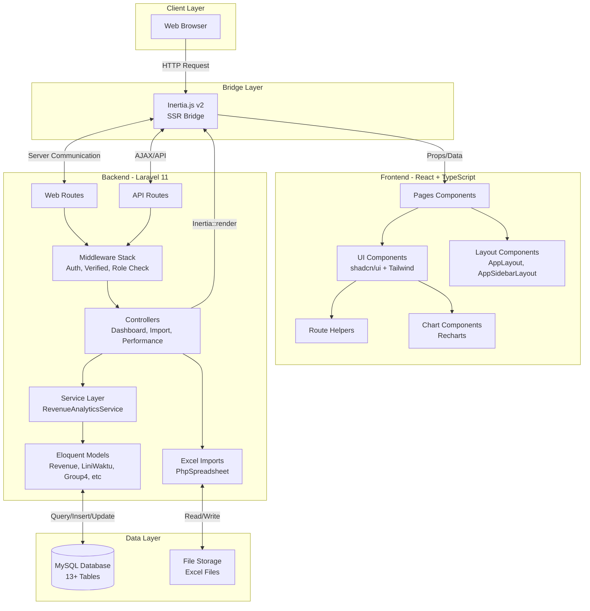

---

## 2. Database Entity Relationship Diagram (ERD)

```mermaid
erDiagram
    USERS {
        bigint id PK
        string name
        string email UK
        string username UK
        string password
        string role "admin, viewer"
        timestamp email_verified_at
        timestamps created_at_updated_at
    }
    
    REGIONS {
        bigint id PK
        string code UK "HQ, TREG1-5"
        string name
        timestamps created_at_updated_at
    }
    
    WITELS {
        bigint idwitels PK
        bigint region_id FK
        string witel
        string lokasi_witel
        timestamps created_at_updated_at
    }
    
    ACCOUNT_MANAGERS {
        string nik PK
        string nama
        string posisi "AM, AM1, AM2, EAM, SAM"
        string no_gsm
        bigint idwitels FK
        timestamps created_at_updated_at
    }
    
    COMPANIES {
        string nip_nas PK
        string nama_perusahaan
        string subsegment "Gold, Silver, Copper"
        string source_data
        timestamps created_at_updated_at
    }
    
    GROUP1 {
        bigint idGroup1 PK
        string nip_nas FK
        string lob_name "Line of Business"
        string segment
        timestamps created_at_updated_at
    }
    
    GROUP2 {
        bigint idGroup2 PK
        bigint group1_id FK
        string layanan "Service Type"
        timestamps created_at_updated_at
    }
    
    GROUP3 {
        bigint idGroup3 PK
        bigint group2_id FK
        string produk "Product Name"
        timestamps created_at_updated_at
    }
    
    GROUP4 {
        bigint idGroup4 PK
        bigint group3_id FK
        string sid "Service ID"
        string unit "Unit/Item"
        timestamps created_at_updated_at
    }
    
    REVENUES {
        bigint id PK
        bigint group4_id FK
        year tahun
        tinyint bulan "1-12"
        decimal revenue_realisasi
        decimal revenue_target
        timestamps created_at_updated_at
        unique group4_id_tahun_bulan
    }
    
    COMPANY_TARGETS {
        bigint id PK
        string nip_nas FK
        int tahun
        tinyint bulan
        decimal target_revenue
        timestamps created_at_updated_at
    }
    
    REVENUE_UPLOADS {
        bigint id PK
        int tahun
        int bulan
        bigint uploaded_by FK
        string original_filename
        string stored_path
        int row_count
        decimal file_size_kb
        string action "upload, replace, delete"
        text description
        string ip_address
        timestamps created_at_updated_at
    }
    
    LINI_WAKTU {
        bigint id PK
        string nik_am FK
        string quartal "Q1-Q4"
        date bulan_awal
        date bulan_akhir
        int tahun
        decimal percentage_result
        decimal percentage_revenue
        decimal percentage_scaling
        decimal percentage_datin
        decimal percentage_hsi
        decimal percentage_wireline
        decimal percentage_wifi
        decimal percentage_cyc
        decimal percentage_cr
        decimal percentage_profit
        decimal percentage_customer
        decimal percentage_proses
        decimal percentage_maps
        decimal percentage_lop
        decimal percentage_capability
        decimal percentage_cc
        timestamps created_at_updated_at
    }
    
    TARGET_ACCOUNT_M {
        bigint id PK
        decimal t_revenue "Target Revenue"
        decimal t_scalling
        decimal t_datin
        decimal t_hsi
        decimal t_wireline
        decimal t_wifi
        decimal t_cyc
        decimal t_cr
        decimal t_profit
        decimal t_nps
        decimal t_maps
        decimal t_lop
        decimal t_capability
        decimal t_cc
        timestamps created_at_updated_at
    }
    
    LINI_WAKTU_TARGET {
        bigint id PK "Pivot Table"
        bigint lini_waktu_id FK
        bigint target_id FK
        decimal r_revenue "Realisasi Revenue"
        decimal r_scalling
        decimal r_datin
        decimal r_hsi
        decimal r_wireline
        decimal r_wifi
        decimal r_cyc
        decimal r_cr
        decimal r_profit
        decimal r_nps
        decimal r_maps
        decimal r_lop
        decimal r_capability
        decimal r_cc
        timestamps created_at_updated_at
    }
    
    PERFORMANCE_UPLOADS {
        bigint id PK
        int tahun
        string quartal
        bigint uploaded_by FK
        string original_filename
        string stored_path
        int row_count
        decimal file_size_kb
        string action
        text description
        string ip_address
        timestamps created_at_updated_at
    }
    
    ACCOUNT_MANAGER_COMPANY {
        bigint id PK "Pivot Table"
        string nik_am FK
        string nip_nas FK
        date tanggal_mulai
        date tanggal_selesai
        timestamps created_at_updated_at
    }
    
    %% User Relationships
    USERS ||--o{ REVENUE_UPLOADS : uploads
    USERS ||--o{ PERFORMANCE_UPLOADS : uploads
    
    %% Regional Hierarchy
    REGIONS ||--o{ WITELS : contains
    WITELS ||--o{ ACCOUNT_MANAGERS : manages
    
    %% Account Manager Relationships
    ACCOUNT_MANAGERS ||--o{ LINI_WAKTU : has_kpi
    ACCOUNT_MANAGERS ||--o{ ACCOUNT_MANAGER_COMPANY : manages
    
    %% KPI Target & Realization (Many-to-Many via Pivot)
    LINI_WAKTU ||--o{ LINI_WAKTU_TARGET : has_targets
    TARGET_ACCOUNT_M ||--o{ LINI_WAKTU_TARGET : tracked_in
    LINI_WAKTU_TARGET }o--|| LINI_WAKTU : belongs_to
    LINI_WAKTU_TARGET }o--|| TARGET_ACCOUNT_M : achieves
    
    %% Company & Product Hierarchy
    COMPANIES ||--o{ GROUP1 : has_lob
    COMPANIES ||--o{ COMPANY_TARGETS : has_targets
    COMPANIES ||--o{ ACCOUNT_MANAGER_COMPANY : managed_by
    GROUP1 ||--o{ GROUP2 : has_layanan
    GROUP2 ||--o{ GROUP3 : has_produk
    GROUP3 ||--o{ GROUP4 : has_unit
    
    %% Revenue Relationships
    GROUP4 ||--o{ REVENUES : generates
    REVENUES }o--|| GROUP4 : belongs_to
    
    %% Upload History
    LINI_WAKTU }o--|| ACCOUNT_MANAGERS : belongs_to
    REVENUE_UPLOADS }o--|| USERS : uploaded_by
    PERFORMANCE_UPLOADS }o--|| USERS : uploaded_by
```

---

## 3. Authentication & Authorization Flow

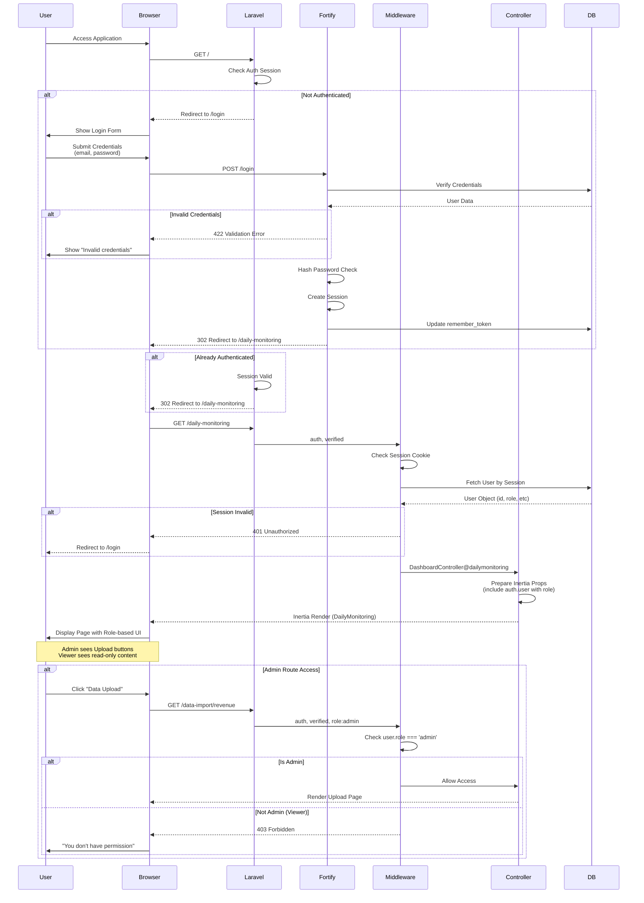

---

## 4. User Journey Flow

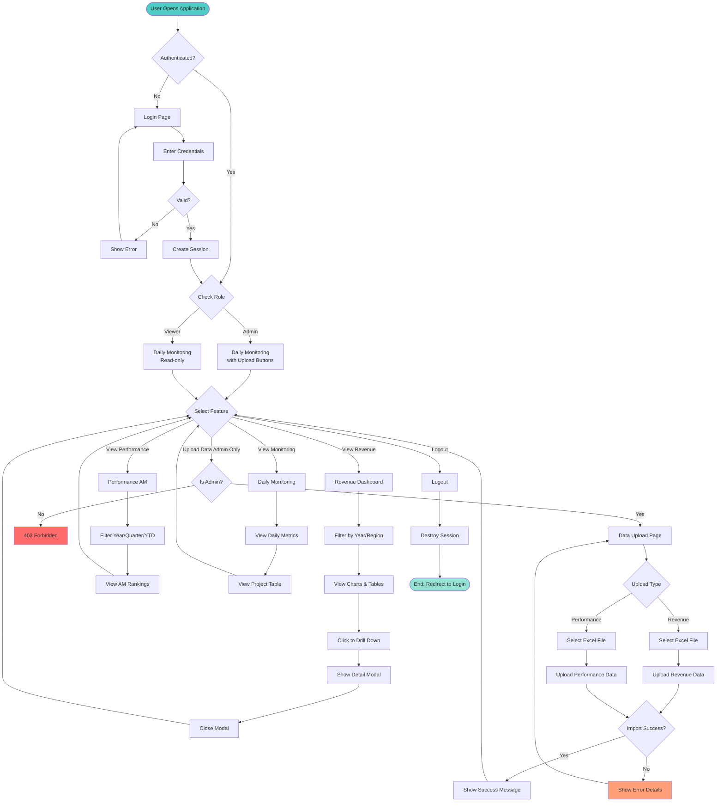

---

## 5. Revenue Dashboard - Complete Backend Flow

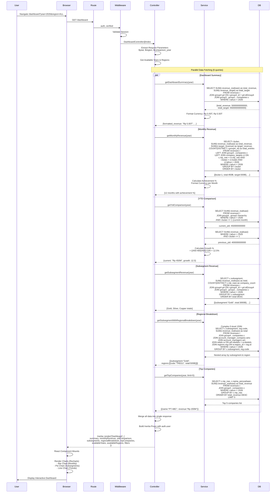

---

## 6. Revenue Dashboard - Frontend State Flow

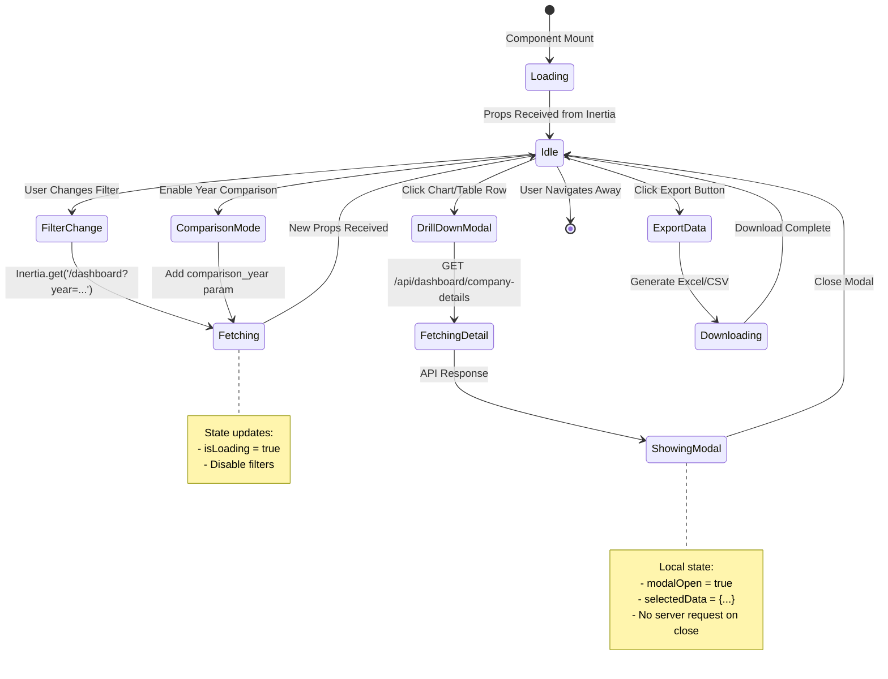

---

## 7. Performance AM - Backend Processing Flow

```mermaid
sequenceDiagram
    participant User
    participant Browser
    participant Controller
    participant DB
    
    User->>Browser: Navigate /performance-am?year=2026&quartal=Q1&ytd=0&region=ALL
    Browser->>Controller: GET /performance-am
    
    Controller->>Controller: Extract & Validate Parameters<br/>$year=2026, $quartal=Q1,<br/>$ytd=0, $region=ALL
    
    alt No Quartal Provided
        Controller->>Controller: getCurrentQuartal()<br/>Based on current date
    end
    
    Controller->>Controller: Determine Quartals to Include
    
    alt YTD Mode (ytd=1)
        Controller->>Controller: getQuartalsForYTD(Q1)<br/>→ [Q1]
        Controller->>Controller: getQuartalsForYTD(Q2)<br/>→ [Q1, Q2]
        Controller->>Controller: getQuartalsForYTD(Q3)<br/>→ [Q1, Q2, Q3]
        Controller->>Controller: getQuartalsForYTD(Q4)<br/>→ [Q1, Q2, Q3, Q4]
    else Single Quartal
        Controller->>Controller: quartalList = [Q1]
    end
    
    par Fetch AM Metrics
        Controller->>DB: getTotalAM(region)
        DB->>DB: SELECT COUNT(*) as total<br/>FROM account_managers am<br/>LEFT JOIN witels w ON am.idwitels = w.idwitels<br/>LEFT JOIN regions r ON w.region_id = r.id<br/>WHERE r.code = 'ALL' OR r.code = region
        DB-->>Controller: total_am: 150
    and Target Revenue
        Controller->>DB: getTotalRevenueTarget(2026, [Q1])
        DB->>DB: SELECT lw.id FROM lini_waktu lw<br/>LEFT JOIN account_managers am<br/>LEFT JOIN witels...regions r<br/>WHERE lw.tahun = 2026<br/>AND lw.quartal IN ('Q1')<br/>AND (r.code = region OR region = 'ALL')
        DB-->>DB: liniWaktuIds: [1,2,3,...]
        DB->>DB: SELECT SUM(tam.t_revenue) as total<br/>FROM target_account_m tam<br/>JOIN lini_waktu_target lwt ON tam.id = lwt.target_id<br/>WHERE lwt.lini_waktu_id IN (1,2,3,...)
        DB-->>Controller: revenue_target: 1500000000000
    and Actual Revenue
        Controller->>DB: getTotalRevenueActual(2026, [Q1])
        DB->>DB: Same liniWaktuIds fetch as target
        DB->>DB: SELECT SUM(lwt.r_revenue) as total<br/>FROM lini_waktu_target lwt<br/>WHERE lwt.lini_waktu_id IN (1,2,3,...)
        DB-->>Controller: revenue_actual: 1450000000000
    end
    
    par Fetch Performance Data
        Controller->>DB: getAMRevenueRanking(2026, [Q1])
        DB->>DB: SELECT am.nik, am.nama,<br/>reg.code as region_code,<br/>COALESCE(SUM(tam.t_revenue), 0) as t_revenue,<br/>COALESCE(SUM(lwt.r_revenue), 0) as r_revenue<br/>FROM account_managers am<br/>LEFT JOIN witels w ON am.idwitels = w.idwitels<br/>LEFT JOIN regions reg ON w.region_id = reg.id<br/>LEFT JOIN lini_waktu lw ON am.nik = lw.nik_am<br/>  AND lw.tahun = 2026<br/>  AND lw.quartal IN ('Q1')<br/>LEFT JOIN lini_waktu_target lwt ON lw.id = lwt.lini_waktu_id<br/>LEFT JOIN target_account_m tam ON lwt.target_id = tam.id<br/>GROUP BY am.nik, am.nama, reg.code<br/>ORDER BY t_revenue DESC
        DB-->>Controller: [{nik:"123", nama:"John", t_revenue:50B, r_revenue:48B}, ...]
    and Region Distribution
        Controller->>DB: getRegionDistribution()
        DB->>DB: SELECT COUNT(*) FROM account_managers
        DB-->>DB: totalAM: 150
        DB->>DB: SELECT reg.code, COUNT(am.nik) as am_count<br/>FROM account_managers am<br/>JOIN witels w...regions reg<br/>GROUP BY reg.code<br/>ORDER BY am_count DESC
        DB-->>Controller: [{code:"TREG1", count:30, percentage:20%}, ...]
    and Regional Performance
        Controller->>DB: getRegionalPerformance(2026, [Q1])
        DB->>DB: Complex query with:<br/>- SUM(tam.t_revenue) per region<br/>- SUM(lwt.r_revenue) per region<br/>- TOP 3 AM per region by achievement<br/>- Company count per region
        DB-->>Controller: [{region:"TREG1",<br/>target:300B, actual:290B,<br/>top3:[{am:"John", achievement:98%}]}]
    and Best Performance
        Controller->>DB: getBestPerformance(2026, [Q1])
        DB->>DB: SELECT am.nik, am.nama,<br/>SUM(tam.t_revenue) as target,<br/>SUM(lwt.r_revenue) as actual,<br/>(SUM(lwt.r_revenue)/SUM(tam.t_revenue)*100) as achievement<br/>FROM account_managers am<br/>JOIN lini_waktu...lini_waktu_target...target_account_m<br/>WHERE achievement >= 100<br/>ORDER BY achievement DESC<br/>LIMIT 10
        DB-->>Controller: Top 10 best performers
    and AM List
        Controller->>DB: getAccountManagerList()
        DB->>DB: SELECT am.*, w.witel, reg.code<br/>FROM account_managers am<br/>JOIN witels w...regions reg<br/>ORDER BY am.nik
        DB-->>Controller: Complete AM list with details
    end
    
    Controller->>Controller: Format all currency values (M/T)
    Controller->>Controller: Calculate achievement percentages
    Controller->>Controller: Build Inertia Response
    
    Controller-->>Browser: Inertia::render('PerformanceAm', {<br/>  amMetrics: {total_am, revenue_target, revenue_actual},<br/>  amRevenueRanking: [...],<br/>  regionalPerformance: [...],<br/>  bestPerformance: [...],<br/>  accountManagerList: [...],<br/>  availableYears: [...],<br/>  availableQuartals: [...],<br/>  currentYear: 2026,<br/>  currentQuartal: 'Q1',<br/>  currentYtd: 0<br/>})
    
    Browser->>Browser: React Renders Charts & Tables
    Browser->>User: Display Performance Dashboard
```

---

## 8. Performance AM - YTD Mode Flow

```mermaid
flowchart TD
    Start([User Selects YTD Mode]) --> CheckQuartal{Current Quartal?}
    
    CheckQuartal -->|Q1| SetQ1[quartalList = [Q1]]
    CheckQuartal -->|Q2| SetQ2[quartalList = [Q1, Q2]]
    CheckQuartal -->|Q3| SetQ3[quartalList = [Q1, Q2, Q3]]
    CheckQuartal -->|Q4| SetQ4[quartalList = [Q1, Q2, Q3, Q4]]
    
    SetQ1 --> QueryLiniWaktu
    SetQ2 --> QueryLiniWaktu
    SetQ3 --> QueryLiniWaktu
    SetQ4 --> QueryLiniWaktu
    
    QueryLiniWaktu[Query lini_waktu with<br/>WHERE quartal IN quartalList]
    
    QueryLiniWaktu --> GetLiniWaktuIds[Get all lini_waktu IDs]
    
    GetLiniWaktuIds --> ParallelQueries{Parallel Queries}
    
    ParallelQueries -->|Query 1| SumTarget[SUM t_revenue<br/>from target_account_m<br/>via lini_waktu_target<br/>WHERE lini_waktu_id IN ids]
    ParallelQueries -->|Query 2| SumActual[SUM r_revenue<br/>from lini_waktu_target<br/>WHERE lini_waktu_id IN ids]
    
    SumTarget --> AggregateData[Aggregate YTD Data]
    SumActual --> AggregateData
    
    AggregateData --> CalculateAchievement[Calculate Achievement %<br/>= actual / target * 100]
    
    CalculateAchievement --> FormatCurrency[Format Currency<br/>Add M/T suffix]
    
    FormatCurrency --> ReturnYTD[Return YTD Metrics]
    
    ReturnYTD --> End([Display YTD Results])
    
    style Start fill:#4ecdc4
    style End fill:#95e1d3
    style ParallelQueries fill:#f39c12
```

---

## 9. Daily Monitoring - Simple Flow

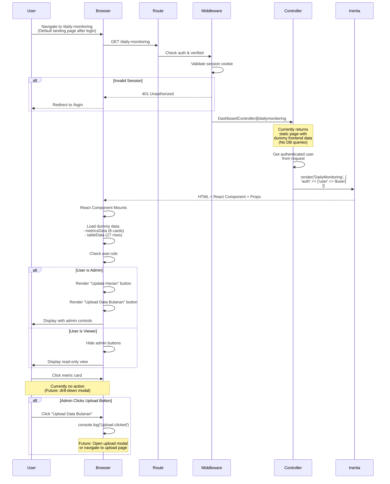

---

## 10. Data Upload Flow - Revenue Import

```mermaid
sequenceDiagram
    participant Admin
    participant Browser
    participant Route
    participant Middleware
    participant Controller as RevenueImportController
    participant Validator
    participant Import as RevenueImport
    participant Sheet as RevenueSheetImport
    participant DB
    participant Storage
    
    Admin->>Browser: Access /data-import/revenue
    Browser->>Route: GET /data-import/revenue
    Route->>Middleware: auth, verified, role:admin
    Middleware->>Middleware: Check user.role === 'admin'
    
    alt Not Admin
        Middleware-->>Browser: 403 Forbidden
        Browser->>Admin: "Access Denied"
    end
    
    Middleware->>Controller: DashboardController@dataImportRevenue
    Controller->>DB: Get upload history & status<br/>per month for selected year
    DB-->>Controller: Activity logs & upload records
    Controller-->>Browser: Inertia::render('DataImportRevenue', {<br/>  monthsData: [...],<br/>  activityLogs: {...},<br/>  availableYears: [...]<br/>})
    
    Admin->>Browser: Select Excel file (Rev 2026.xlsx)<br/>Enter year: 2026<br/>Enter description (optional)
    Browser->>Route: POST /data-import/revenue/upload<br/>FormData {file, year, month, description}
    Route->>Middleware: role:admin
    Middleware->>Controller: RevenueImportController@store
    
    Controller->>Validator: Validate Request
    Validator->>Validator: Check file.required<br/>Check file.mimes (xlsx, xls, csv)<br/>Check file.max (10MB)<br/>Check year.integer (2020-2030)<br/>Check month.integer (1-12)
    
    alt Validation Failed
        Validator-->>Browser: 422 Unprocessable Entity<br/>{errors: {file: ["Format invalid"]}}
        Browser->>Admin: Show validation errors
    end
    
    Validator->>Validator: Check file extension explicitly
    Validator->>Validator: Validate MIME type
    
    alt Invalid File Type
        Validator-->>Browser: 422 Error
        Browser->>Admin: "File is not valid Excel/CSV"
    end
    
    Controller->>DB: BEGIN TRANSACTION
    
    Controller->>Import: new RevenueImport(year, month)<br/>Excel::import($importer, $file)
    
    Import->>Import: Open Excel with PhpSpreadsheet
    Import->>Import: sheets() method<br/>Return array of sheet names to process
    
    Note over Import: Try to import sheets:<br/>"Rev 2026", "Revenue 2026",<br/>"Region_and_Witel"
    
    Import->>Sheet: Import "Rev 2026" sheet
    Sheet->>Sheet: collection() method called<br/>Receive all rows as collection
    
    Sheet->>Sheet: Read header row (row 1)
    Sheet->>Sheet: Map column names to indexes:<br/>NIP_NAS → col A<br/>STANDARD_NAME → col B<br/>SOURCE_DATA → col C<br/>GROUP1-4 → cols D-G<br/>Months 1-12 → cols H-S
    
    loop For each data row (starting row 2)
        Sheet->>Sheet: Extract cell values
        Sheet->>Validator: Validate row data<br/>- NIP_NAS required<br/>- Company name required<br/>- At least one month has revenue
        
        alt Row Invalid
            Sheet->>Sheet: Add to errors array<br/>{row: 5, field: "NIP_NAS", error: "Required"}
            Note over Sheet: Continue to next row
        end
        
        Sheet->>DB: Find or Create Company<br/>Company::firstOrCreate([<br/>  'nip_nas' => $nipNas<br/>], [<br/>  'nama_perusahaan' => $name,<br/>  'subsegment' => $subsegment<br/>])
        DB-->>Sheet: company object
        
        Sheet->>DB: Create hierarchical groups:<br/>Group1::firstOrCreate(...)<br/>Group2::firstOrCreate(...)<br/>Group3::firstOrCreate(...)<br/>Group4::firstOrCreate(...)
        DB-->>Sheet: group4_id
        
        loop For each month (1-12)
            alt Month has revenue value
                Sheet->>DB: Revenue::updateOrCreate([<br/>  'group4_id' => $group4Id,<br/>  'tahun' => 2026,<br/>  'bulan' => $month<br/>], [<br/>  'revenue_realisasi' => $revenueValue,<br/>  'revenue_target' => 0<br/>])
                DB-->>Sheet: Revenue record created/updated
                Sheet->>Sheet: Increment success counter
            end
        end
    end
    
    Sheet-->>Import: Return import stats<br/>{success: 150, errors: 5, skipped: 0}
    Import-->>Controller: Return aggregated stats<br/>{total_success: 150,<br/>total_errors: 5,<br/>years_imported: [2026],<br/>year_stats: {...}}
    
    Controller->>DB: Count imported records<br/>SELECT COUNT(*) FROM revenues<br/>WHERE tahun = 2026
    DB-->>Controller: total_records: 150
    
    Controller->>DB: Calculate total revenue<br/>SELECT SUM(revenue_realisasi)<br/>FROM revenues WHERE tahun = 2026
    DB-->>Controller: total_revenue: 5000000000000
    
    Controller->>Storage: Store uploaded file<br/>$file->storeAs(<br/>  "revenue-uploads/2026",<br/>  "1_20260120143022_Rev2026.xlsx"<br/>)
    Storage-->>Controller: stored_path
    
    Controller->>DB: RevenueUpload::create([<br/>  'tahun' => 2026,<br/>  'bulan' => 1,<br/>  'uploaded_by' => auth()->id(),<br/>  'original_filename' => 'Rev2026.xlsx',<br/>  'stored_path' => $path,<br/>  'action' => 'upload',<br/>  'row_count' => 150,<br/>  'file_size_kb' => 245.67,<br/>  'description' => $description,<br/>  'ip_address' => $request->ip()<br/>])
    DB-->>Controller: Upload logged
    
    Controller->>DB: COMMIT
    
    alt Import Successful
        Controller-->>Browser: Redirect with success<br/>"Imported 150 records for 2026"
        Browser->>Admin: Show success toast notification
        Browser->>Browser: Refresh upload history table
    else Import with Errors
        Controller-->>Browser: Return with errors<br/>{status: "warning",<br/>import_stats: {...},<br/>import_errors: [{row:5, error:"..."}]}
        Browser->>Admin: Show warning with error details<br/>"150 imported, 5 failed"
    end
```

---

## 11. Data Upload Flow - Performance Import

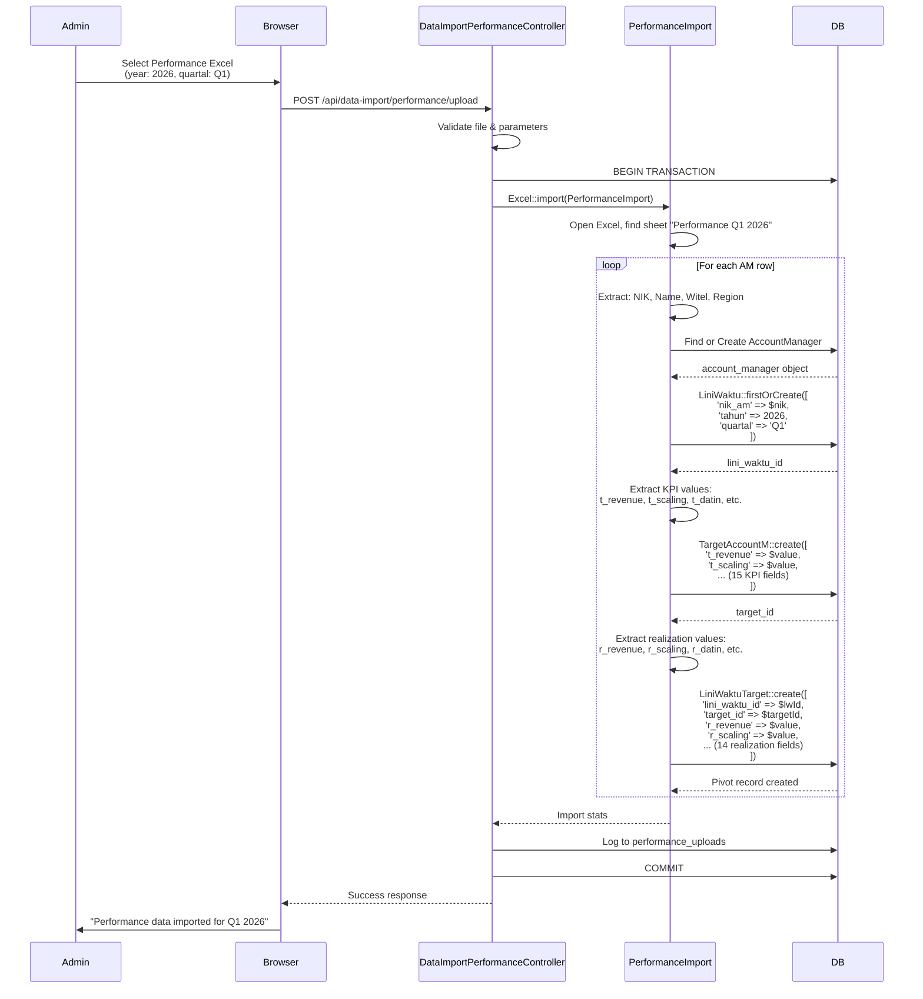

---

## 12. Excel Import Processing Pipeline

```mermaid
flowchart TD
    Start([Admin Uploads Excel File]) --> Validate{Validate File}
    
    Validate -->|Invalid Extension| Error1[Return 422:<br/>"File format not supported"]
    Validate -->|Invalid MIME| Error2[Return 422:<br/>"File is not valid Excel"]
    Validate -->|Invalid Size| Error3[Return 422:<br/>"File too large max 10MB"]
    Validate -->|Valid| OpenFile[Open Excel with PhpSpreadsheet]
    
    OpenFile --> DetectSheets{Detect Sheets}
    DetectSheets -->|Rev YYYY found| ProcessRevenue[Process Revenue Sheet]
    DetectSheets -->|Performance Q* found| ProcessPerformance[Process Performance Sheet]
    DetectSheets -->|Region_and_Witel found| ProcessRegion[Process Region/Witel Sheet]
    DetectSheets -->|No valid sheet| Error4[Return 422:<br/>"No valid sheet found"]
    
    ProcessRevenue --> ReadHeader[Read Header Row]
    ReadHeader --> MapColumns[Map Column Names to Indexes]
    MapColumns --> ValidateStructure{Validate Structure}
    
    ValidateStructure -->|Missing columns| Error5[Return 422:<br/>"Required columns missing"]
    ValidateStructure -->|Valid| LoopStart{For Each Row}
    
    LoopStart -->|Has Row| ReadRow[Read Row Data]
    ReadRow --> ValidateRow{Validate Row Data}
    
    ValidateRow -->|Invalid| LogError[Add to Error Array:<br/>{row, field, message}]
    LogError --> LoopStart
    
    ValidateRow -->|Valid| FindCompany[Find or Create Company<br/>in companies table]
    FindCompany --> CreateHierarchy[Create Group Hierarchy:<br/>Group1 → Group2 → Group3 → Group4]
    CreateHierarchy --> CheckMonth{Has Revenue Value?}
    
    CheckMonth -->|No| LoopStart
    CheckMonth -->|Yes| UpsertRevenue[Upsert Revenue Record:<br/>updateOrCreate by<br/>group4_id, tahun, bulan]
    
    UpsertRevenue --> CountSuccess[Increment Success Counter]
    CountSuccess --> LoopStart
    
    LoopStart -->|No More Rows| CalcStats[Calculate Statistics:<br/>- Total records<br/>- Success count<br/>- Error count<br/>- Total revenue]
    
    CalcStats --> StoreFile[Store File in Storage:<br/>/revenue-uploads/YYYY/]
    StoreFile --> LogUpload[Log Upload to DB:<br/>revenue_uploads table]
    
    LogUpload --> CheckErrors{Has Errors?}
    CheckErrors -->|Yes| ReturnWarning[Return 200 OK with warnings:<br/>"X imported, Y failed"<br/>+ error details array]
    CheckErrors -->|No| ReturnSuccess[Return 200 OK:<br/>"Successfully imported X records"]
    
    ReturnWarning --> Commit[COMMIT Transaction]
    ReturnSuccess --> Commit
    
    Commit --> End([Redirect with Flash Message])
    
    Error1 --> RollbackEnd([End: Validation Failed])
    Error2 --> RollbackEnd
    Error3 --> RollbackEnd
    Error4 --> RollbackEnd
    Error5 --> Rollback[ROLLBACK Transaction]
    Rollback --> RollbackEnd
    
    style Start fill:#4ecdc4
    style End fill:#95e1d3
    style RollbackEnd fill:#ff6b6b
    style CheckErrors fill:#ffa07a
    style UpsertRevenue fill:#f38181
    style Commit fill:#a8e6cf
```

---

## 13. Excel Sheet Detection Flow

```mermaid
flowchart TD
    Start([Excel File Uploaded]) --> LoadFile[PhpSpreadsheet Load File]
    
    LoadFile --> GetSheetNames[Get All Sheet Names]
    
    GetSheetNames --> CheckRevenue{Check for<br/>'Rev YYYY' or<br/>'Revenue YYYY'?}
    
    CheckRevenue -->|Found| AddRevenue[Add to Import Queue:<br/>RevenueSheetImport]
    CheckRevenue -->|Not Found| CheckPerformance
    
    AddRevenue --> CheckPerformance{Check for<br/>'Performance Q* YYYY'?}
    
    CheckPerformance -->|Found| AddPerformance[Add to Import Queue:<br/>PerformanceSheetImport]
    CheckPerformance -->|Not Found| CheckRegion
    
    AddPerformance --> CheckRegion{Check for<br/>'Region_and_Witel'?}
    
    CheckRegion -->|Found| AddRegion[Add to Import Queue:<br/>RegionWitelSheetImport]
    CheckRegion -->|Not Found| CheckQueue
    
    AddRegion --> CheckQueue{Import Queue<br/>Empty?}
    
    CheckQueue -->|Yes| Error[Throw Exception:<br/>"No valid sheets found"]
    CheckQueue -->|No| ProcessSheets[Process Each Sheet<br/>in Queue]
    
    ProcessSheets --> End([Return Import Results])
    Error --> EndError([Return 422 Error])
    
    style Start fill:#4ecdc4
    style End fill:#95e1d3
    style EndError fill:#ff6b6b
```

---

## 14. Data Validation Flow

```mermaid
flowchart TD
    Start([Validate Row Data]) --> CheckNIPNAS{NIP_NAS<br/>exists?}
    
    CheckNIPNAS -->|No| ErrorNIPNAS[Error: "NIP_NAS required"]
    CheckNIPNAS -->|Yes| ValidateNIPNAS{NIP_NAS<br/>format valid?}
    
    ValidateNIPNAS -->|No| ErrorFormat[Error: "Invalid NIP_NAS format"]
    ValidateNIPNAS -->|Yes| CheckCompanyName{Company Name<br/>exists?}
    
    CheckCompanyName -->|No| ErrorName[Error: "Company name required"]
    CheckCompanyName -->|Yes| CheckSubsegment{Subsegment<br/>valid?}
    
    CheckSubsegment -->|No| ErrorSubsegment[Error: "Invalid subsegment:<br/>must be Gold/Silver/Copper"]
    CheckSubsegment -->|Yes| CheckRevenue{At least one<br/>month has<br/>revenue?}
    
    CheckRevenue -->|No| ErrorRevenue[Error: "No revenue data found"]
    CheckRevenue -->|Yes| ValidateRevenue{Revenue values<br/>valid?}
    
    ValidateRevenue -->|Has negative| ErrorNegative[Error: "Revenue cannot be negative"]
    ValidateRevenue -->|Has non-numeric| ErrorNumeric[Error: "Revenue must be numeric"]
    ValidateRevenue -->|Valid| CheckDuplicate{Already exists<br/>for this month?}
    
    CheckDuplicate -->|Yes| WarnDuplicate[Warning: "Will overwrite existing data"]
    CheckDuplicate -->|No| PassValidation[✓ Validation Passed]
    
    WarnDuplicate --> PassValidation
    
    PassValidation --> Success([Return Valid])
    
    ErrorNIPNAS --> Failed([Return Invalid + Error])
    ErrorFormat --> Failed
    ErrorName --> Failed
    ErrorSubsegment --> Failed
    ErrorRevenue --> Failed
    ErrorNegative --> Failed
    ErrorNumeric --> Failed
    
    style Start fill:#4ecdc4
    style Success fill:#95e1d3
    style Failed fill:#ff6b6b
    style PassValidation fill:#a8e6cf
```

---

## 15. Service Layer Architecture

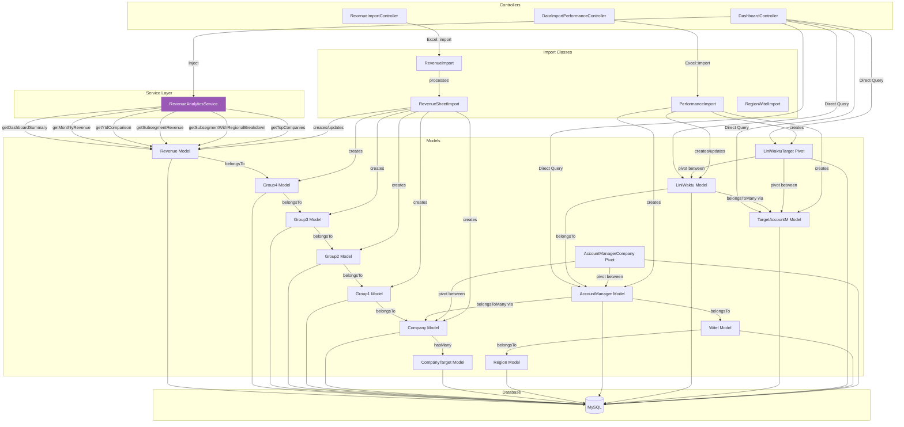

---

## 16. Route Structure & Middleware Flow

```mermaid
graph TB
    subgraph "Entry Point"
        Root[/ - root]
    end
    
    subgraph "Public Routes"
        Login[/login - Fortify]
        Register[/register - Fortify]
    end
    
    subgraph "Authenticated Routes auth+verified"
        Dashboard[/dashboard<br/>Revenue Dashboard]
        PerformanceAM[/performance-am<br/>Performance AM]
        DailyMonitoring[/daily-monitoring<br/>Daily Monitoring]
        
        subgraph "API Endpoints"
            API1[/api/dashboard/monthly-data]
            API2[/api/dashboard/month-details]
            API3[/api/dashboard/company-details]
            API4[/api/dashboard/subsegment-details]
            API5[/api/dashboard/ytd-comparison-custom]
            API6[/api/dashboard/available-periods]
        end
    end
    
    subgraph "Admin Only Routes auth+verified+role:admin"
        DataImportRev[/data-import/revenue<br/>Revenue Upload Page]
        DataImportPerf[/data-import/performance<br/>Performance Upload Page]
        
        subgraph "Upload Endpoints POST"
            UploadRev[/data-import/revenue/upload]
            UploadPerf[/api/data-import/performance/upload]
        end
        
        subgraph "Download Endpoints GET"
            DownloadTemplate[/data-import/revenue/download-template/{year}]
            DownloadFile[/data-import/revenue/download/{year}/{month}]
            DownloadYear[/data-import/revenue/download-year/{year}]
            PerfTemplate[/api/data-import/performance/template]
        end
        
        subgraph "Delete Endpoints DELETE"
            DeleteMonth[/data-import/revenue/delete/{year}/{month}]
            DeleteYear[/data-import/revenue/delete/{year}]
            DeletePerf[/api/data-import/performance/delete/{year}/{quarter}]
        end
    end
    
    subgraph "Middleware Stack"
        Web[web middleware]
        Auth[auth]
        Verified[verified]
        RoleAdmin[role:admin]
    end
    
    %% Flow
    Root -->|redirect| Login
    Login -->|POST /login| Web
    Web --> Auth
    
    Auth -->|Pass| Verified
    Verified -->|Pass| Dashboard
    Verified -->|Pass| PerformanceAM
    Verified -->|Pass| DailyMonitoring
    Verified -->|Pass| API1
    Verified -->|Pass| API2
    Verified -->|Pass| API3
    Verified -->|Pass| API4
    Verified -->|Pass| API5
    Verified -->|Pass| API6
    
    Verified -->|Pass| RoleAdmin
    RoleAdmin -->|Admin| DataImportRev
    RoleAdmin -->|Admin| DataImportPerf
    RoleAdmin -->|Admin| UploadRev
    RoleAdmin -->|Admin| UploadPerf
    RoleAdmin -->|Admin| DownloadTemplate
    RoleAdmin -->|Admin| DownloadFile
    RoleAdmin -->|Admin| DownloadYear
    RoleAdmin -->|Admin| PerfTemplate
    RoleAdmin -->|Admin| DeleteMonth
    RoleAdmin -->|Admin| DeleteYear
    RoleAdmin -->|Admin| DeletePerf
    
    RoleAdmin -->|Not Admin| Forbidden[403 Forbidden]
    
    style RoleAdmin fill:#ff6b6b
    style Auth fill:#4ecdc4
    style Verified fill:#45b7d1
    style Forbidden fill:#e74c3c
```

---

## 17. API Request/Response Flow

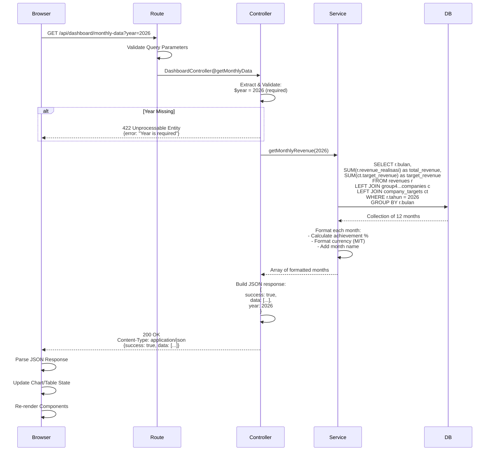

---

## 18. State Management & Data Flow (Frontend)

```mermaid
flowchart LR
    subgraph "Laravel Backend"
        Controller[Controller] -->|Inertia::render| InertiaResponse[Inertia Response<br/>JSON Props]
    end
    
    subgraph "Inertia Bridge"
        InertiaResponse -->|HTTP Response<br/>X-Inertia: true| InertiaCore[Inertia Core<br/>Client-side Router]
    end
    
    subgraph "React Frontend"
        InertiaCore -->|Initial Props| PageComponent[Page Component<br/>Dashboard.tsx]
        
        PageComponent -->|useState| LocalState[Local State<br/>filters, modals]
        PageComponent -->|usePage hook| SharedProps[Shared Props<br/>auth, errors, flash]
        
        LocalState --> UIComponents[UI Components<br/>Charts, Tables, Modals]
        SharedProps --> UIComponents
        
        UIComponents -->|User Action<br/>Filter change| EventHandler[Event Handler<br/>handleFilterChange]
        
        EventHandler -->|router.get| InertiaCore
        EventHandler -->|Axios.get| DirectAPI[Direct API Call<br/>for drill-down data]
        
        DirectAPI -->|JSON Response| UpdateLocal[Update Local State<br/>setModalData]
        UpdateLocal --> UIComponents
    end
    
    InertiaCore -->|New HTTP Request<br/>preserveScroll| Controller
    
    Controller -->|New Props<br/>Same page| InertiaCore
    
    style InertiaCore fill:#9b59b6,color:#fff
    style PageComponent fill:#3498db,color:#fff
    style LocalState fill:#f39c12
    style SharedProps fill:#e74c3c,color:#fff
    style DirectAPI fill:#2ecc71
```

---

## 19. Error Handling Flow

```mermaid
flowchart TD
    Start([Error Occurs]) --> CheckType{Error Type?}
    
    CheckType -->|Validation Error| Handle422[422 Unprocessable Entity]
    CheckType -->|Authentication Error| Handle401[401 Unauthorized]
    CheckType -->|Authorization Error| Handle403[403 Forbidden]
    CheckType -->|Not Found| Handle404[404 Not Found]
    CheckType -->|Server Error| Handle500[500 Internal Server Error]
    CheckType -->|Database Error| HandleDB[Database Exception]
    
    Handle422 --> Format422[Format Validation Errors:<br/>{errors: {field: ["message"]}}]
    Format422 --> ReturnJSON422[Return JSON Response]
    ReturnJSON422 --> DisplayForm[Display Errors in Form]
    
    Handle401 --> Redirect401[Redirect to /login]
    Redirect401 --> ShowLogin[Show Login Page<br/>with flash message]
    
    Handle403 --> Display403[Display 403 Page:<br/>"Access Denied"]
    
    Handle404 --> Display404[Display 404 Page:<br/>"Page Not Found"]
    
    Handle500 --> LogError[Log Error to logs/laravel.log]
    LogError --> Display500[Display Generic Error:<br/>"Something went wrong"]
    
    HandleDB --> CheckEnv{Environment?}
    CheckEnv -->|Production| DisplayGeneric[Display Generic Error]
    CheckEnv -->|Development| DisplayDetailed[Display Detailed Error<br/>with Stack Trace]
    
    DisplayForm --> End([User Sees Error])
    ShowLogin --> End
    Display403 --> End
    Display404 --> End
    Display500 --> End
    DisplayGeneric --> End
    DisplayDetailed --> End
    
    style Handle500 fill:#ff6b6b
    style HandleDB fill:#ff6b6b
    style Handle403 fill:#ffa07a
    style Handle401 fill:#f39c12
```

---

## 20. File Storage & Management Flow

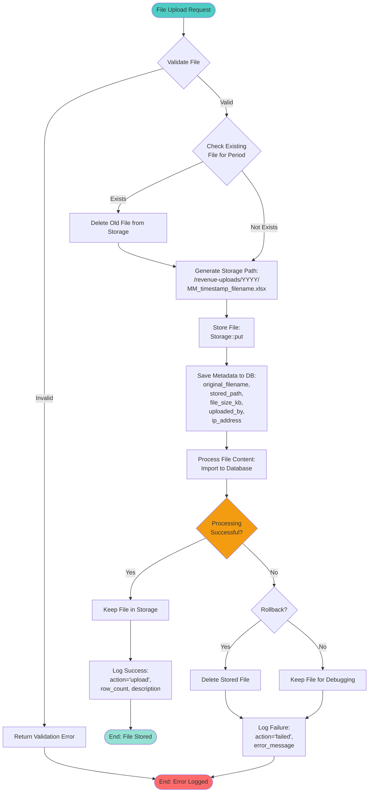

---

## Ringkasan Flow Diagram

| # | Diagram | Tipe | Deskripsi |
|---|---------|------|-----------|
| 1 | System Architecture Overview | Graph | Arsitektur lengkap: Client → Frontend → Bridge → Backend → Database |
| 2 | Database ERD | Entity Relationship | 13+ tables dengan relationships lengkap |
| 3 | Authentication & Authorization Flow | Sequence | Login flow dengan Fortify, session management, role check |
| 4 | User Journey Flow | Flowchart | Complete user journey dari login sampai logout |
| 5 | Revenue Dashboard Backend Flow | Sequence | Parallel queries (6 data sources) untuk dashboard |
| 6 | Revenue Dashboard Frontend State | State Diagram | State management di React: Loading → Idle → Fetching → Modal |
| 7 | Performance AM Backend Flow | Sequence | Complex queries dengan YTD mode dan pivot tables |
| 8 | Performance AM YTD Mode | Flowchart | Logic untuk YTD calculation berdasarkan quartal |
| 9 | Daily Monitoring Flow | Sequence | Simple flow dengan dummy data dan role-based UI |
| 10 | Revenue Import Flow | Sequence | Complete upload flow dengan validation dan error handling |
| 11 | Performance Import Flow | Sequence | Upload flow untuk KPI data dengan pivot table creation |
| 12 | Excel Import Pipeline | Flowchart | Detailed pipeline: validation → parsing → database → logging |
| 13 | Excel Sheet Detection | Flowchart | Logic untuk detect sheet names (Rev YYYY, Performance, etc) |
| 14 | Data Validation Flow | Flowchart | Row-level validation dengan multiple checks |
| 15 | Service Layer Architecture | Graph | Dependencies: Controllers → Services → Models → DB |
| 16 | Route & Middleware Flow | Graph | Route structure dengan middleware chains |
| 17 | API Request/Response | Sequence | API endpoint flow dengan JSON response |
| 18 | State Management Frontend | Flowchart | Inertia props flow dan local state management |
| 19 | Error Handling Flow | Flowchart | Error types dan handling strategies |
| 20 | File Storage & Management | Flowchart | File upload, storage, dan cleanup flow |

---

## Catatan Teknis

### Konvensi Diagram
- **Graph TB/LR**: Top-Bottom atau Left-Right direction
- **Sequence**: Interaction antar komponen dengan timeline
- **Flowchart**: Decision tree dengan conditional branches
- **State**: State transitions dan lifecycle
- **Entity Relationship**: Database schema dengan foreign keys

### Warna Coding
- 🟦 **Biru (#4ecdc4)**: Start/Entry points
- 🟩 **Hijau (#95e1d3)**: Success/End states
- 🟥 **Merah (#ff6b6b)**: Error/Failure states
- 🟧 **Orange (#ffa07a)**: Warning/Validation states
- 🟪 **Purple (#9b59b6)**: Important components (Inertia, Services)

### Best Practices untuk Maintenance
1. **Update diagram saat ada perubahan struktur database**
2. **Sync dengan actual code di controllers dan services**
3. **Tambahkan diagram baru untuk fitur baru**
4. **Review diagram secara periodik untuk accuracy**
5. **Gunakan consistent naming dengan actual code**

---

**Dokumentasi ini comprehensive dan mencakup semua flow utama dalam aplikasi TWS Dashboard.**
